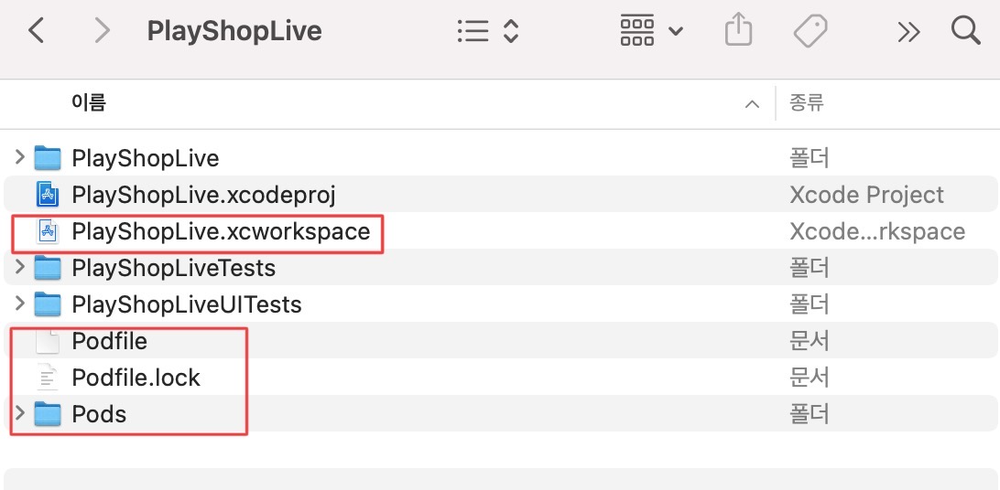
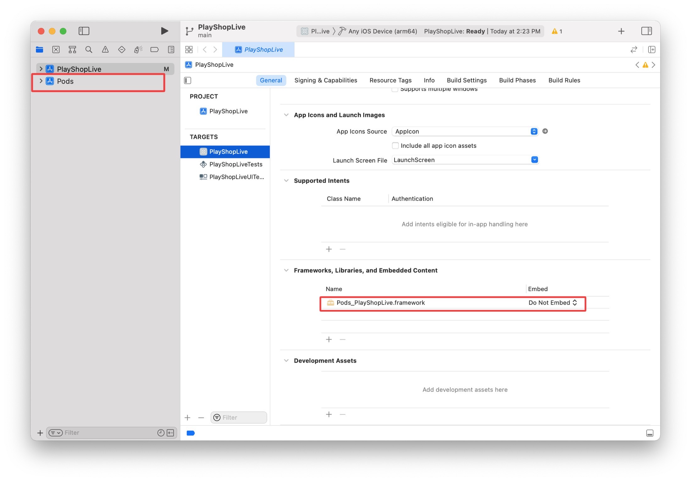
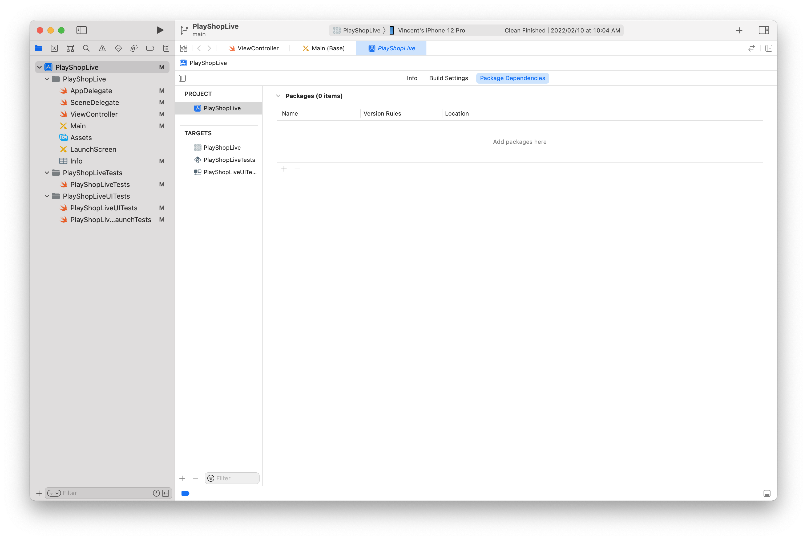
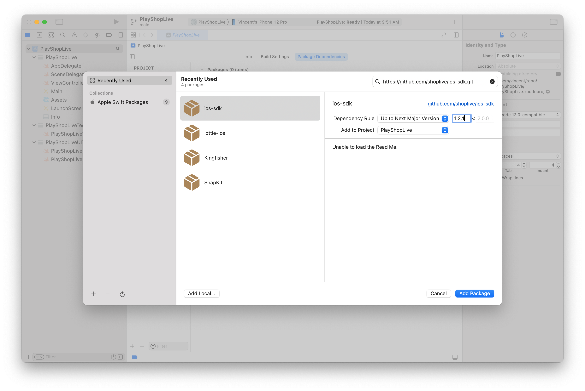
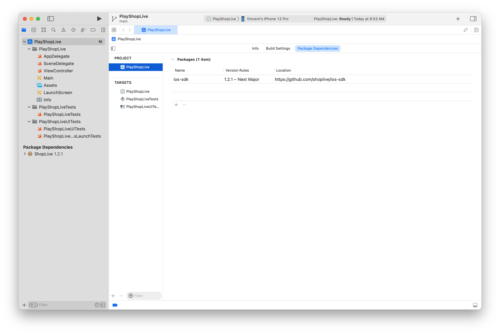
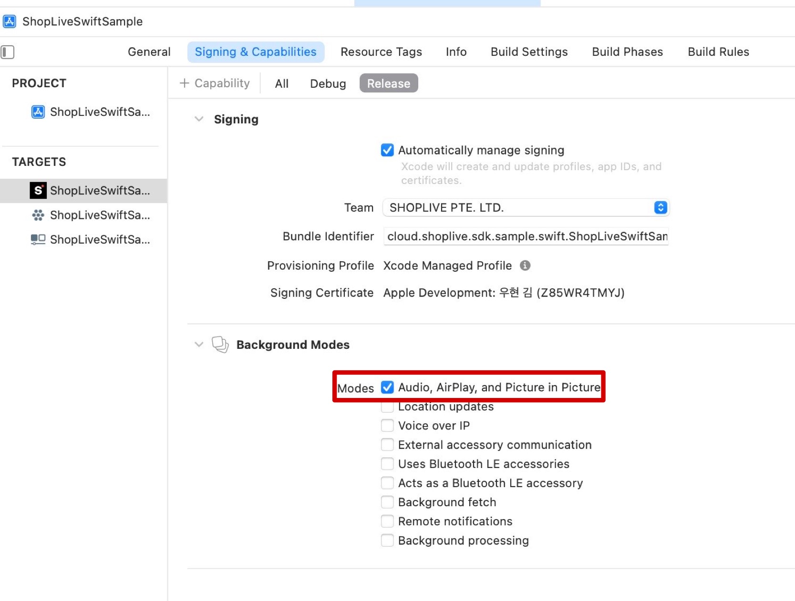
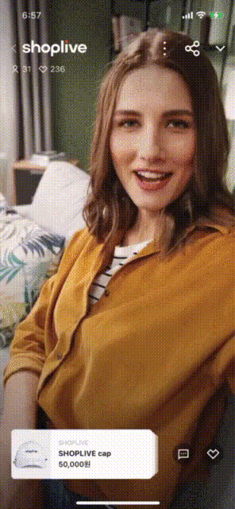
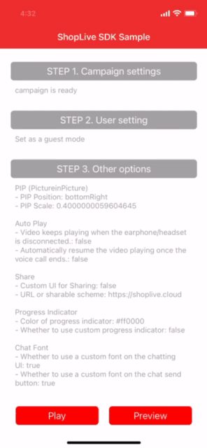
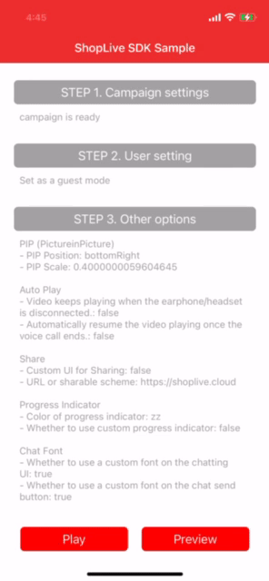
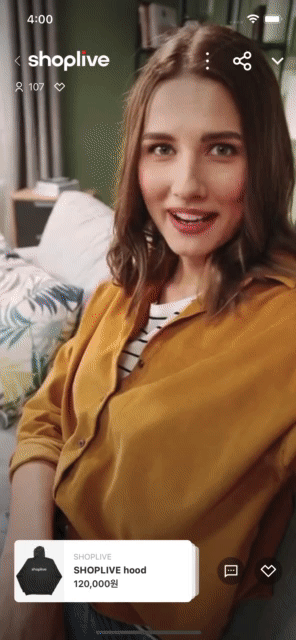

- [Shoplive iOS SDK](#shoplive-ios-sdk)
  - [Introduction](#introduction)
  - [Feature](#feature)
  - [Requirements](#requirements)
  - [Changes](#changes)
- [Before starting](#before-starting)
- [Getting started](#getting-started)
  - [`Step 1` Installing](#step-1-installing)
    - [`Method 1` Installing using CocoaPods](#method-1-installing-using-cocoapods)
    - [`Method 2` Installing using Swift Package Manager](#method-2-installing-using-swift-package-manager)
  - [`Step 2` Running Shoplive Player](#step-2-running-shoplive-player)
  - [`Step 3` Using Shoplive chat](#step-3-using-shoplive-chat)
  - [`Step 4` Using coupon](#step-4-using-coupon)
  - [`Step 5` Managing products](#step-5-managing-products)
  - [`Step 6` Sharing a campaign link](#step-6-sharing-a-campaign-link)
  - [`Step 7` Running as PIP(Picture-in-Picture) mode](#step-7-running-as-pippicture-in-picture-mode)
  - [`Step 8` Setting the indicator](#step-8-setting-the-indicator)
  - [`Step 9` Setting interrupt options while playing Shoplive Player](#step-9-setting-interrupt-options-while-playing-shoplive-player)
  - [`Step 10` Setting the aspect ratio in tablet portrait mode](#step-10-setting-the-aspect-ratio-in-tablet-portrait-mode)
  - [`Step 11` Setting Shoplive Player's next action when a user selects a link](#step-11-setting-shoplive-players-next-action-when-a-user-selects-a-link)

- [Reference - API Documentation](./api-document.md)

<br>

# Shoplive iOS SDK

<br>

## Introduction

Shoplive iOS SDK is a mobile SDK that allows users to quickly and easily provide live campaign to customers using the app. Enable a seamless mobile experience on smartphones, including Shoplive PIP(Picture-in-Picture) mode and native keyboard UI.

<image src="../_images/guide.gif" width="200" height="410"></image>

## Feature

- Installable using `CocoaPods` or  `Swift Package Manager`
- Shoplive campaign available using Shoplive Player
- Possible to induce users to watch Shoplive campaign by displaying Shoplive campaign set to low quality/muted in PIP mode.
- Chatting and product search available as users watch Shoplive campaign
- Startable and switchable the Shoplive campaign in PIP(picture-in-picture) mode from within the app or from the home view
- Chatting is possible in unauthenticated user mode, and Real-time user information who participated in the chat delivery is possible
- Chatting is possible in authenticated user mode, and User account consolidation is possible with simple authentication/security authentication
- Changeable the Chat Nicknames fonts and Chat fonts
- coupons are available
- Product management possible using multiple functions
- Native system shared UI or Custom system shared UI available
- Shareable the Link to the campaign that is playing
- Configurable the interrupt option while playing Shoplive Player
- Configurable the aspect ratio in tablet portrait mode
- Real-time reception possible the various information about the campaign being played
- Real-time reception possible  the various information about the Shoplive iOS SDK

<br>

## Requirements

These are the minimum requirements to use the Shoplive iOS SDK. <br> If you do not meet these requirements, you cannot use the Shoplive iOS SDK.

- `Xcode 12` and above
- `iOS 11` and above
- `iOS Deployment Target 11.0` and above
- `Swift 4.2` and above

<br>

## Changes

  + We improved to link quiz functions such as vibration and sound effects.
  + We improved to does not switch to PIP in the app even if the user swipes down when there is an Analog Dialog or other screen in Shoplive Player.
  + Added API that is selectable the next action instead of forcibly switching to PIP in the app when the user selects a product or notices.
  + Added API to set endpoint.
- \[[Previous version update](./change-log.md)]

<br>

# Before starting

- To use the Shoplive iOS SDK, ask the Shoplive representative for an admin account and password.
  
  + \[[Make a request](mailto:ask@Shoplive.cloud)]

- Add campaigns in Shoplive admin and write down Campaign Key.
  
  + \[[Admin Guide - Creating Campaign](https://en.shoplive.guide/docs/create-campaign)]

<br>

# Getting started

Install the Shoplive iOS SDK and simply apply it to Shoplive Player.

<br>

## `Step 1` Installing

Choose one of the following methods to install the Shoplive iOS SDK.

> `Shoplive iOS SDK installation must be done with only one method.`  
`If you install with both [Method 1 Install with CocoaPods] and [Method 2 Install with Swift Package Manager], the Shoplive iOS SDK may be installed duplicately.`

### `Method 1` Installing using CocoaPods

Install the Shoplive iOS SDK using `CocoaPods`.

- Set the `CocoaPods`.
  
  ```bash
  # Go to the Project home directory. (the path where the file with the .xcodeproj extension is located)
  cd ~/projects/PlayShopLive
  
  # If the CocoaPods is not installed, install the CocoaPods.
  sudo gem install cocoapods
  
  # If you have never set the CocoaPods in an existing project, create the Podfile.
  pod init
  ```

- Add the following line to the Podfile currently using.
  
    

  ```ruby
  source 'https://github.com/CocoaPods/Specs.git'
  
  # Set it to be the same as the minimum supported version set in Project. 
  # Shoplive iOS SDK supports iOS 11.0 and above. You can't set it below iOS 11.0.
  platform: ios, '11.0'
  use_frameworks!
  
  # Set a Project Target to install the Shoplive iOS SDK.
    target 'PlayShopLive' do
      pod 'ShopLive', '1.2.2'
  end
  ```

- Install `CocoaPods`.
  
  ```bash
  # Run the installation command from the Project home directory.
  # Run the update command together to apply the updated contents in the pod storage.
  
  # Method 1. After update the pod repo, install the pod
  pod repo update
  pod install
  
  # Method 2. Running update pod repo and install the pod at the same time
  pod install --repo-update
  ```
  
  - If it is not installed on Apple M1, run the following command.
    ```bash
    sudo arch -x86_64 gem install ffi
    arch -x86_64 pod install
    ```

- When the installation is complete, check the following items in Project.

- Check the created file in Finder.
  
   

- Open the xcworkspace file to check the Project.
  
  


### `Method 2` Installing using Swift Package Manager

Install the Shoplive iOS SDK using `Swift Package Manager`.

- Go to the Package Dependencies tab of  Xcode Project. 

- Enter the Shoplive iOS SDK git address to install, select the `Up to Next Major Version`, and set the latest version. `https://github.com/ShopLive/ios-SDK.git`
  
    

- Select the Target to apply the Shoplive iOS SDK package. 

- Check the Shoplive iOS SDK installed in Packages. 

## `Step 2` Running Shoplive Player

### Open Shoplive Player

- Initialize the Shoplive iOS SDK using the prepared Access Key.
  
  ```swift
  ShopLive.configure(with: "{AccessKey}")
  ```
  
  - API Reference
    > [configure(with:)](./api-document.md#configurewith)
  
  <br>

  #### Play the campaign
  
  Use the campaign key to play the campaign.
  
  - Preview
      
    - Start the preview in PIP(picture-in-picture) mode in the app.
    - The preview plays in muted.
        
      ```swift
      ShopLive.preview(with: "{CampaignKey}", completion: nil)
      ```
    
    - API Reference
      > [preview(with:, completion:)](./api-document.md#previewwith-completion)
    
      

  
  - Play 
      ```swift
      ShopLive.play(with: "{CampaignKey}")`     
  <br>

     - API Reference 
        > [play(with:)](./api-document.md#playwith)
     
        

<br>

## `Step 3` Using Shoplive chat


### Getting ready to use the chat.

- Set access to chat in Shoplive admin.
  
  + \[[Shoplive Admin Guide - Preparing Campaign - Chat Settings](https://en.shoplive.guide/docs/preps-for-campaign#chat-settings)]
        
- ### Chat as an unauthenticated user
  
    - Connect to chat without any authentication.
    - If it does not allow unauthenticated users to chat, even if select the chat button, no response occurs.
      - If unauthenticated user nicknames are not set to be mandatory, unauthenticated user nicknames are randomly assigned.
      
         
    
      - If set the unauthenticated user's nickname to be mandatory and enter the chat, the unauthenticated user's nickname setting popup appears. An unauthenticated user's nickname must be set to join the chat.
      
         

- ### Chat as an authenticated user
  
  - #### User account integration
    
    - Integrate with simple authentication
      
      - The ability to set the user's ID and login user's nickname allows the integration of user accounts in the service.
      
      - User ID, name, age, gender, user score, and other user-defined data information can be set.
        
        ```swift
        import ShopLiveSDK
        
        var user = ShopLiveUser(
            id: "{USER_ID}", 
            name: "{USER_NAME}", 
            gender: .male, 
            age: 25)
        user.add(["userScore" : userScore])
        
        ShopLive.user = user
        ```
        
        - API Reference
          > [user](./api-document.md#user)
        
          <image src="../_images/chat_nickname.png" width="200" height="356"></image>
    
    - Integrate with secure authentication
      
      - Information such as user ID and name can be set in the Shoplive iOS SDK by using the security authentication token (JWT) granted as the campaign key issued by the Shoplive admin.
        
        <B>\[Ask the Shoplive representative to create a secure authentication token (JWT)]</B>

        - It must generate a secure authentication token (JWT) on the client server and provide it to the App client via the Shoplive iOS SDK API.
        - Users can be authenticated using the Campaign Key issued by the Shoplive admin.
  
            - [[Secure authentication token (JWT) Creation Guide](https://en.shoplive.guide/docs/use-jwt-auth)]
      
                ```swift
                ShopLive.authToken = "{USER_JWT}"
                ```
      
                - API Reference
                  > [authToken](./api-document.md#authtoken)

                  <br>

- ### Changing nickname
  
  - When a user changes their nickname in Shoplive Player, the Shoplive iOS SDK delivers the change to the client using the onSetUserName function.
    
    ```swift
    func onSetUserName(_ payload: [String : Any]) {
        payload.forEach { (key, value) in
        print("onSetUserName key: \(key) value: \(value)")
        }
    }
    ```
    
    - API Reference
  
      > [onSetUserName(_ payload: [String : Any])](./api-document.md#onsetusername_-payload)

<br>

- ### Changing the chat font
  
  - Set the chat font and chat send button font.
    
      
  
  - Change font
    
    ```swift
    // Chat font setting
    let inputDefaultFont = UIFont.systemFont(ofSize: 14, weight: .regular)

    // Chat send button font setting
    let sendButtonDefaultFont = UIFont.systemFont(ofSize: 14, weight: .medium)

    let customFont = UIFont(name: "{Custom Font}", size: 16)

    // Change chat font and chat send button font 
    ShopLive.setChatViewFont(inputBoxFont: customFont, sendButtonFont: customFont)
    ```
    
    - API Reference
      > [setChatViewFont(inputBoxFont:, sendButtonFont:)](./api-document.md#setchatviewfontinputboxfont-sendbuttonfont)

<br>

 - ### While streaming live, It is possible to manage chats from the Shoplive admin.
  
   + \[[Shoplive Admin Guide - Preparing Campaign - Chat Settings](https://en.shoplive.guide/docs/preps-for-campaign#chat-settings)]


<br>

## `Step 4` Using coupon

- General coupons and custom coupons (pop-up) are available.
  
  <image src="../_images/coupon.png" width="200" height="356"></image>

- When a user selects a coupon, the coupon applying flow is as follows. 
  
  <image src="https://github.com/shoplive/ios-sdk-sample/blob/main/doc/_images/Coupon%20selection_applying%20flow_en.jpg" width="729.4" height="353.4"></image>

- <B>General coupon</B>
  
  - Users can select the general coupon registered by the administrator on the campaign view and apply for the benefits set in the coupon (eg, discount, etc.).
    
    ```swift
    func handleDownloadCouponResult(with couponId: String, completion: @escaping (CouponResult) -> Void) {
        // Coupon handling
        let result = CouponResult(couponId: couponId, success: false, message: "Coupon download failed.", status: .HIDE, alertType: .TOAST)
        completion(result)
    }
    ```
    
    - API Reference
      > [handleDownloadCouponResult(with: completion:)](./api-document.md#handledownloadcouponresultwith-completion)

- <B>Custom Coupon (Pop-up)</B>
  
  - Users can select the custom coupon (pop-up) registered by the administrator on the campaign view and apply for the benefits set in the coupon ((eg, discount, etc.).
    
    ```swift
    func handleCustomActionResult(with id: String, type: String, payload: Any?, completion: @escaping (CustomActionResult) -> Void) {
        // Custum coupon handling
        let result = CustomActionResult(id: id, success: false, message: "coupon download failed.", status: .HIDE, alertType: .TOAST)
        completion(result)
    }
    ```
    
    - API Reference
      > [handleCustomActionResult(with id:, type:, payload:, completion:)](./api-document.md#handlecustomactionresultwith-id-type-payload-completion)

      <br>

## `Step 5` Managing products

The event that occurs when a product is selected or a shopping cart is selected on the Shoplive Player view and the selected information are sent to the client by the Shoplive iOS SDK.

- ### Delivering Events Using Handler Functions
  
  - #### handleReceivedCommand
    
    - <B>CLICK\_PRODUCT\_DETAIL</B>
      
      - When the user selects a product from the product list on the Shoplive Player view, the Shoplive iOS SDK uses the handleReceivedCommand function to deliver the selected product information to the client.
        ```swift
        func handleReceivedCommand(_ command: String, with payload: Any?) {
            // print("handleReceivedCommand: \(command) payload: \(payload)")
        
            // Command: CLICK_PRODUCT_DETAIL
        
        }
        ```
    
    - <B>CLICK\_PRODUCT\_CART</B>
      
      - When the user selects a shopping cart button from the product list on the Shoplive Player view, the Shoplive iOS SDK uses the handleReceivedCommand function to deliver the shopping cart information to the client.
        
        ```swift
        func handleReceivedCommand(_ command: String, with payload: Any?) {
            // print("handleReceivedCommand: \(command) payload: \(payload)")
    
            // Command: CLICK_PRODUCT_CART
    
        }
        ```
    
    - API Reference
      
      > [handleReceivedCommand(\_ command: , with payload:)](./api-document.md#handlereceivedcommand_-command--with-payload)

      <br>
  
  - #### handleNavigation
    
    When the user selects a product, banner, etc. from the product list on the Shoplive Player view, Shoplive iOS SDK uses the handleNavigation function to deliver the URL information of the selected item to the client.
    
    ```swift
    func handleNavigation(with url: URL) {
        // URL: Detailed information URL set for the selected product or banner
        print("handleNavigation \(url)")
    }
    ```
    
    - API Reference
      > [handleNavigation(with:)](./api-document.md#handlenavigationwith)

<br>

- ### Delivering Events Using API Functions
  
  - #### hookNavigation
    
    When using hookNavigation, an event is directly received by the block set in the parameter when a user selects a product or banner.
    
    ```swift
    ShopLive.hookNavigation { url in
        // url: Detailed information URL set for the selected product or banner
        print("hookNavigation \(url)")
    }
    ```
    
    - API Reference
      > [hookNavigation(navigation:](./api-document.md#hooknavigationnavigation-escaping-url---void)[ @escaping ((URL) -> Void))](./api-document.md#hooknavigationnavigation-escaping-url---void)

<br>

## `Step 6` Sharing a campaign link

> Users can easily share the URI scheme or URL of a campaign through Shoplive's Sharing API.

- ### Sharing Link Format
  
  - **Set the URI Scheme**
    
    ```swift
    let scheme = "{your host}://{your host}?ak=xxx&ck=yyy"
    ShopLive.setShareScheme(with: scheme, custom: nil)
    ```
  
  - **Set the URL**
    
    ```swift
    let url = "https://www.share_link.com/?ak=xxx&ck=yyy"
    ShopLive.setShareScheme(with: "https://www.share_link.com/?ak=xxx&ck=yyy", custom: nil)
    ```
  
  - API Reference
    
    > [setShareScheme(\_ scheme:, custom:)](./api-document.md#setsharescheme_-scheme-custom)

<br>

- ### Using the default system shared UI
  
    

  ```swift
  ShopLive.setShareScheme(scheme, custom: nil)
  ```

- ### Using the custom system shared UI
  
    

  ```swift
  ShopLive.setShareScheme(scheme, custom: {
      let customShareVC = CustomShareViewController()
      customShareVC.modalPresentationStyle = .overFullScreen
  
      // Create a custom system shared UI ViewController and display it on the Shoplive Player view (viewController).
      ShopLive.viewController?.present(customShareVC, animated: false, completion: nil)
  })
  ```

- By sharing the campaign link being played on social media or other platforms users can induce potential users to install the app or watch the campaign just by clicking the shared link. (However, users have to handle deeplink separately in the app.)
  
    


## `Step 7` Running as PIP(Picture-in-Picture) mode

When performing other tasks while watching a campaign, users can switch to picture-in-picture mode.

- ### Switching in-app PIP(picture-in-picture) mode
  
  - The user can switch the view of the campaign being played into a small window within the app by selecting the picture-in-picture mode icon on the Shoplive Player view, or by using the Swipe down gesture.
  
  - Unlike the preview function, even if the user switches to the in-app PIP mode, the campaign audio continues to play.
    
      
  
  - Setting the PIP(picture-in-picture) size     The user sets the size of the PIP view within the app.
    
    > Size setting example
    
    ```swift
    // Deafult: 0.4
    
    // set to 0.1x size
    ShopLive.pipScale = 0.1
    
    // set to 0.8x size
    ShopLive.pipScale = 0.8
    ```
    
    | Size| PIP view| Size| PIP view| Size| PIP view
    |----------|----------|----------|----------|----------|----------
    | 0.1| | 0.4 (default)| | 0.8| 


- ### Switching OS PIP(Picture-in-Picture) mode
  
  - During campaign playing, even if the user navigates to the home view or navigates to another app through the home button or home indicator, the playing campaign can be switched to a small window within iOS.
  
  - Set the Project as follows.
    
      
      

- ### Switching in-app PIP(picture-in-picture) mode using API
  
  - #### Switching in-app PIP(picture-in-picture) mode
    
    ```swift
    ShopLive.startPictureInPicture()
    ```
  
  - #### Switching full-view mode
    
    ```swift
    ShopLive.stopPictureInPicture()
    ```
  
  - API Reference
    
    > [startPictureInPicture(with: , scale: )](./api-document.md#startpictureinpicturewith--scale-)    <br>
[stopPictureInPicture()](./api-document.md#stoppictureinpicture)

<br>

## `Step 8` Setting the indicator

- ### Setting the indicator color
  
  - The user can change the indicator style that appears while entering the campaign and loading the video.
  
  - Changing the indicator color (Default: white)
    
    ```swift
    ShopLive.indicatorColor = UIColor.purple
    ```

    

  
  - API Reference
    
    > [indicatorColor](./api-document.md#indicatorcolor)

    <br>

- ### Setting the Image Animation Indicator 
  
  > Users can set the indicator to an image animation. 
  
  

  
  ```swift
  var images: [UIImage] = []
  
  for i in 1...11 {
      images.append(.init(named: "loading\(i)")!)
  }
  
  ShopLive.setLoadingAnimation(images: images)
  ```
  
  - API Reference
    > [setLoadingAnimation(images:)](./api-document.md#setloadinganimationimages)

<br>

## `Step 9` Setting interrupt options while playing Shoplive Player

> When an interrupt event occurs due to a call or earphone connection loss during playing, the user can set the Shoplive Player playing action after the interrupt event ended.

- ### Interrupt due to earphone (or headset) disconnection
  
  > When earphones or headsets are disconnected, user can set them to play automatically when they are reconnected.
  
  ```swift
  // option setting - true: Autoplay, default: false
  ShopLive.setKeepPlayVideoOnHeadphoneUnplugged(true)
  
  // Check the option settings
  print(ShopLive.isKeepPlayVideoOnHeadPhoneUnplugged())
  ```
  
  - API Reference
    > [setKeepPlayVideoOnHeadphoneUnplugged(\_ keepPlay: Bool)](./api-document.md#setkeepplayvideoonheadphoneunplugged_-keepplay-bool)  <br>
    [isKeepPlayVideoOnHeadPhoneUnplugged() -> Bool](./api-document.md#iskeepplayvideoonheadphoneunplugged---bool)

- ### Interrupt due to call connection 
  
  > When returning to the campaign after the call ended, the user can set it to play automatically.
  
  ```swift
  // option setting - true: Autoplay, default: false
  ShopLive.setAutoResumeVideoOnCallEnded(true)
  
  // Check the option settings
  print(ShopLive.isAutoResumeOnCallEnded())
  ```
  
  - API Reference
    > [setAutoResumeVideoOnCallEnded(\_ autoResume: Bool)](./api-document.md#setautoresumevideooncallended_-autoresume-bool)   <br>
    [isAutoResumeVideoOnCallEnded() -> Bool](./api-document.md#isautoresumevideooncallended---bool)

<br>

## `Step 10` Setting the aspect ratio in tablet portrait mode

> The user can keep the proportions of the Shoplive view in portrait mode on tablet, or let it fill the view.

| fill the view| keep aspect ratio
|----------|----------
| | 

```swift
// keep aspect ratio
ShopLive.setKeepAspectOnTabletPortrait(true)

// fill the view
ShopLive.setKeepAspectOnTabletPortrait(false)
```

- API Reference
  > [setKeepAspectOnTabletPortrait(\_ keep:)](./api-document.md#setkeepaspectontabletportrait_-keep)

<br>

## `Step 11` Setting Shoplive Player's next action when a user selects a link

> When a user selects a link, such as a product, announcement, or banner, the following actions of Shoplive Player can be set.

+ Switch to PIP

    

    ```swift
    ShopLive.setNextActionOnHandleNavigation(.PIP)
    ```

+ Keep in status

    

    ```swift
    ShopLive.setNextActionOnHandleNavigation(.KEEP)
    ```

+ Close

    

    ```swift
    ShopLive.setNextActionOnHandleNavigation(.CLOSE)
    ```
<br>

+ API Reference
    > [setNextActionOnHandleNavigation(actionType:)](./api-document.md#setnextactiononhandlenavigationactiontype)  
    > [getNextActionTypeOnHandleNavigation() -> ActionType](./api-document.md#getnextactiontypeonhandlenavigation---actiontype)
    
<br>
