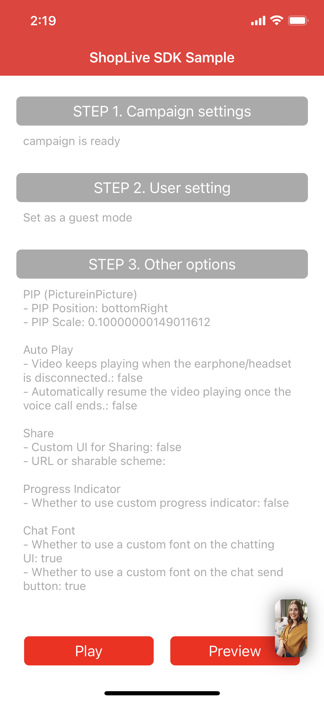
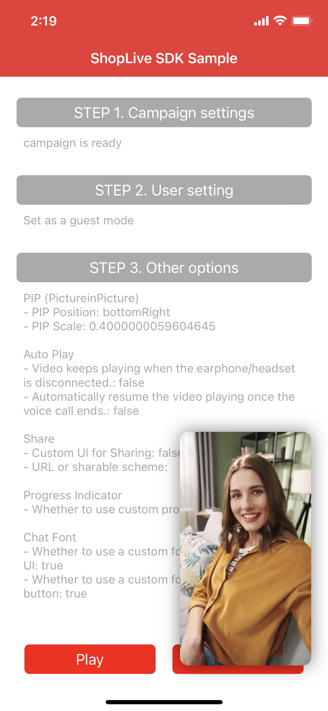

- [API - Play](#api---play)
    - [configure(with:)](#configurewith)
    - [play(with:)](#playwith)
    - [preview(with:, completion:)](#previewwith-completion)

    <br>
- [API - Option](#api---option)
    - [setShareScheme(_ scheme:, custom:)](#setsharescheme_-scheme-custom)
    - [setChatViewFont(inputBoxFont:, sendButtonFont:)](#setchatviewfontinputboxfont-sendbuttonfont)
    - [setLoadingAnimation(images:)](#setloadinganimationimages)
    - [pipPosition](#pipposition)
    - [pipScale](#pipscale)
    - [startPictureInPicture(with: , scale: )](#startpictureinpicturewith--scale-)
    - [stopPictureInPicture()](#stoppictureinpicture)
    - [hookNavigation(navigation: @escaping ((URL) -> Void))](#hooknavigationnavigation-escaping-url---void)
    - [setKeepAspectOnTabletPortrait(_ keep:)](#setkeepaspectontabletportrait_-keep)
    - [user](#user)
    - [authToken](#authtoken)
    - [style](#style)
    - [viewController](#style)
    - [indicatorColor](#indicatorcolor)
    - [isSuccessCampaignJoin() -> Bool](#issuccesscampaignjoin---bool)
    - [AutoResumeVideoOnCallEnded 옵션](#autoresumevideooncallended-옵션)
        - [setAutoResumeVideoOnCallEnded(_ autoResume: Bool)](#setautoresumevideooncallended_-autoresume-bool)
        - [isAutoResumeVideoOnCallEnded() -> Bool](#isautoresumevideooncallended---bool)
    - [KeepPlayVideoOnHeadphoneUnplugged 옵션](#keepplayvideoonheadphoneunplugged-옵션)
        - [setKeepPlayVideoOnHeadphoneUnplugged(_ keepPlay: Bool)](#setkeepplayvideoonheadphoneunplugged_-keepplay-bool)
        - [isKeepPlayVideoOnHeadPhoneUnplugged() -> Bool](#iskeepplayvideoonheadphoneunplugged---bool)

    <br>
- [Handler (delegate)](#handler-delegate)
    - [delegate](#delegate)
    - [handleNavigation(with:)](#handlenavigationwith)
    - [handleChangeCampaignStatus(status:)](#handlechangecampaignstatusstatus)
    - [handleCampaignInfo(campaignInfo:)](#handlecampaigninfocampaigninfo)
    - [onSetUserName(_ payload:)](#onsetusername_-payload)
    - [handleCommand(_ command: , with payload:)](#handlecommand_-command--with-payload)
    - [handleReceivedCommand(_ command: , with payload:)](#handlereceivedcommand_-command--with-payload)
        - [handleReceivedCommand 목록](#handlereceivedcommand-목록)
            - [CLICK_PRODUCT_DETAIL](#click_product_detail)
            - [CLICK_PRODUCT_CART](#click_product_cart)
            - [LOGIN_REQUIRED](#login_required)
            - [ON_SUCCESS_CAMPAIGN_JOIN](#on_success_campaign_join)
    - [Coupon](#coupon)
        - [handleDownloadCouponResult(with: completion:)](#handledownloadcouponresultwith-completion)
        - [handleCustomActionResult(with id:, type:, payload:, completion:)](#handlecustomactionresultwith-id-type-payload-completion)
    - [NextActionOnHandleNavigation 옵션](#nextactiononhandlenavigation-옵션)
        - [setNextActionOnHandleNavigation(actionType:)](#setnextactiononhandlenavigationactiontype)
        - [getNextActionTypeOnHandleNavigation() -> ActionType](#getnextactiontypeonhandlenavigation---actiontype)
    - [setEndpoint(_ url:)](#setendpoint_-url)
    - [handleError(code:, message:)](#handleerrorcode-message)

    


<br>
<br>

# iOS Shoplive API Document

<br>

## API - Play

- ### configure(with:)

    > Shoplive 담당자에게 받은 액세스 키(Access Key)를 사용하여 Shoplive iOS SDK를 초기화합니다.  

    ```swift
    configure(with accessKey: String)
    ```

    | 매개변수 | 설명 |
    | ---------- | --- |
    | AccessKey  | Shoplive 담당자에게 받은 액세스 키(Access Key) |

    ```swift
    ShopLive.configure(with: "{AccessKey}")
    ```

    <br>

    > 적용 가이드  
    - [Shoplive Player 실행하기](./index.md#2-단계-Shoplive-Player-실행하기)

<br>

- ### play(with:)

    > 캠페인(방송) 키를 사용하여 영상을 재생합니다.

    ```swift
    play(with campaignKey: String?)
    ```

    | 매개변수 | 설명 |
    | ---------- | --- |
    | campaignKey | 재생할 영상의 캠페인(방송) 키 |

    <br>

    > 샘플 코드
    ```swift
    ShopLive.play(with: "{CampaignKey}")
    ```
    
    <br>

    > 적용 가이드  
    - [Shoplive Player 실행하기](./index.md#2-단계-Shoplive-Player-실행하기)

<br>

- ### preview(with:, completion:)

    > 캠페인(방송) 키를 사용하여 미리보기 뷰로 영상을 재생합니다.  
    > 무음 재생합니다.

    ```swift
    preview(with campaignKey: String?, completion: @escaping () -> Void)
    ```

    | 매개변수 | 설명 |
    | ---------- | --- |
    | campaignKey | 재생할 영상의 캠페인(방송) 키 |
    | completion | 미리보기 뷰를 선택(탭)하면 호출되는 `completion` 블록 함수 |

    <br>

    > 샘플 코드
    ```swift
    ShopLive.preview(with: "{CampaignKey}") {
        // 미리보기 뷰로 재생을 선택(탭) 했을 때 영상을 재생합니다.
        ShopLive.play(with: "{CampaignKey}")
    }
    ```

    <br>

    > 적용 가이드  
    - [Shoplive Player 실행하기](./index.md#2-단계-Shoplive-Player-실행하기)

<br>

- ### close()

    > 시청 중인 방송을 종료합니다.

    ```swift
    close()
    ```

  <br>

    > 샘플 코드
    ```swift
    ShopLive.close()
    ```

    <br>

## API - Option

- ### setShareScheme(_ scheme:, custom:)

    > 공유하기를 선택(탭) 했을 때 시스템 공유 팝업으로 전달할 `scheme`을 설정합니다.  
    > `custom` callback 함수를 설정하면 iOS 시스템 공유 팝업 대신 직접 커스텀 공유 팝업을 구현할 수 있습니다.  

    ```swift
    setShareScheme(_ scheme: String?, custom: (() -> Void)?)
    ```

    | 매개변수 | 설명 |
    | ---------- | --- |
    | scheme  | 공유할 scheme 또는 URL  |
    | custom  | 커스텀 공유 팝업 설정 |

    <br>

    > 샘플 코드


    ```swift
    let scheme = "shoplive://live"
    let scheme = "https://shoplive.cloud/live"

    // iOS 시스템 공유 팝업
    ShopLive.setShareScheme(scheme, custom: nil)

    // 커스텀 공유 팝업
    ShopLive.setShareScheme(scheme, custom: {
        let alert = UIAlertController.init(title: "Use Custom Share", message: nil, preferredStyle: .alert)
        alert.addAction(UIAlertAction(title: "OK", style: .default, handler: { (action) in
        }))
        ShopLive.viewController?.present(alert, animated: true, completion: nil)
    })
    ```

    <br>

    > 적용 가이드  
    - [방송 링크 공유하기](./index.md#6-단계-방송-링크-공유하기)

<br>

- ### setChatViewFont(inputBoxFont:, sendButtonFont:)

    > 채팅 폰트와 채팅 전송 버튼 폰트를 설정합니다.

    ```swift
    setChatViewFont(inputBoxFont: UIFont, sendButtonFont: UIFont)
    ```

    | 매개변수 | 설명 |
    | ---------- | --- |
    | inputBoxFont  | 채팅 폰트  |
    | sendButtonFont  | 채팅 전송 버튼 폰트 |

    <br>

    > 샘플 코드
    ```swift
    /**
        // 채팅 폰트 설정
        let inputDefaultFont = UIFont.systemFont(ofSize: 14, weight: .regular)

        // 채팅 전송 버튼 폰트 설정
        let sendButtonDefaultFont = UIFont.systemFont(ofSize: 14, weight: .medium)

    */

    let customFont = UIFont(name: "{Custom Font}", size: 16)
    
    // 채팅 폰트 및 채팅 전송 버튼 폰트 변경 
    ShopLive.setChatViewFont(inputBoxFont: customFont, sendButtonFont: customFont)
    ```

    <br>

    > 적용 가이드  
    - [채팅 폰트 변경하기](./index.md#채팅-폰트-변경하기)    
<br>

- ### setLoadingAnimation(images:)

    > 영상 로딩 진행률을 이미지 애니메이션으로 설정합니다.

    ```swift
    setLoadingAnimation(images: [UIImage])
    ```
    
    | 매개변수 | 설명 |
    | ---------- | --- |
    | images  | 이미지 애니메이션에 사용할 이미지 `UIImage` 배열 |

    <br>

    > 샘플 코드
    ```swift
    var images: [UIImage] = []

    for i in 1...11 {
        images.append(.init(named: "loading\(i)")!)
    }

    ShopLive.setLoadingAnimation(images: images)
    ```

    <br>

    > 적용 가이드  
    - [인디케이터 설정하기](./index.md#8-단계-인디케이터-설정하기)

<br>

- ### pipPosition
    > PIP 모드를 시작할 때 기본 위치를 지정합니다. \
    > 처음 재생하고 PIP 모드를 시작하면 지정된 위치에서 PIP 모드가 시작됩니다. \
    > 기본값은 default입니다.

    <br>

    ```swift
    public enum PipPosition: Int {
        case topLeft
        case topRight
        case bottomLeft
        case bottomRight
        case `default`
    }
    ```

    | 매개변수 | 설명 |
    | ----------- | --- |
    | topLeft     | 화면 좌상단 |
    | topRight    | 화면 우상단 |
    | bottomLeft  | 화면 좌하단 |
    | bottomRight | 화면 우하단 |
    | default     | 마지막 위치 <br>최초 실행 때에는 화면 우하단에서 시작합니다. |

    <br>

    ```swift
    var pipPosition: ShopLive.PipPosition { get set }
    ```

    <br>

    > 샘플 코드
    ```swift
    print(ShopLive.pipPosition)
    ```

    <br>

    > 적용 가이드  
    - [PIP(Picture-in-Picture)로 실행하기](./index.md#7-단계-pippicture-in-picture로-실행하기)

<br>

- ### pipScale
    > PIP 모드를 시작할 때 기본 크기입니다.\
    > 처음 재생 후 PIP 모드를 시작하면 지정된 크기로 PIP 모드가 시작됩니다.\
    > 기본값은 마지막으로 지정된 값입니다. 마지막으로 지정된 값이 없다면 기본값은 0.4배 크기입니다.

    - 0.0 ~ 1.0 사이의 값을 입력하세요.
    - 기기 화면의 너비(width) 기준으로 축소된 크기의 PIP 모드를 표시합니다.
    - 재생되는 비디오의 PIP 화면 비율로 변경됩니다. 

    <br>

    ```swift
    var pipScale: CGFloat { get set }
    ```

    <br>

    > 샘플 코드
    ```swift
    print(ShopLive.pipScale)
    ```

    <br>

    > 적용 가이드  
    - [PIP(Picture-in-Picture)로 실행하기](./index.md#7-단계-pippicture-in-picture로-실행하기)

<br>

- ### startPictureInPicture(with: , scale: )

    > 전체 화면 모드에서 PIP 모드로 전환합니다.

    ```swift
    startPictureInPicture(with position: ShopLive.PipPosition, scale: CGFloat)
    startPictureInPicture()
    ```

    | 매개변수 | 설명 |
    | ---------- | --- |
    | position | PIP 모드가 시작될 때 위치 <br>  기본값: `default` |
    | scale | 0.0 ~ 1.0 사이의 값 입력 |

    <br>

    > 샘플 코드
    ```swift
    // 0.4배(기본값) 크기로 앱 내 PIP 모드 전환
    ShopLive.startPictureInPicture()

    // 화면 우하단에서 0.1배 크기로 앱 내 PIP 전환
    ShopLive.startPictureInPicture(with: .bottomRight, scale: 0.1)

    // 화면 좌상단에서 0.8배 크기로 앱 내 PIP 전환
    ShopLive.startPictureInPicture(with: .topLeft, scale: 0.8)
    ```

    <br>

    > 크기 설정 예시

    | 크기 | PIP 화면 | 크기 | PIP 화면 | 크기 | PIP 화면 |
    | ----------- | --- | ----------- | --- | ----------- | --- |
    | 0.1 |  | 0.4 <br> (기본) |  | 0.8 |  |
    
    <br>

    > 적용 가이드  
    - [API를 사용하여 앱 내 PIP 상태 전환하기](./index.md#api를-사용하여-앱-내-pip-상태-전환하기)

<br>


- ### stopPictureInPicture()
    > PIP 모드를 전체 화면 모드로 전환합니다.

    ```swift
    stopPictureInPicture()
    ```

    <br>

    > 샘플 코드
    ```swift
    ShopLive.stopPictureInPicture()
    ```

    <br>

    > 적용 가이드  
    - [API를 사용하여 앱 내 PIP 상태 전환하기](./index.md#api를-사용하여-앱-내-pip-상태-전환하기)

<br>

- ### hookNavigation(navigation: @escaping ((URL) -> Void))
    > 상품 또는 배너를 선택할 때 매개변수에 설정한 `custom` Callback 함수(매개변수로 입력한 `navigation`)로 직접 이벤트를 받습니다.

    ```swift
    hookNavigation(navigation: @escaping ((URL) -> Void))
    ```

    | 매개변수 | 설명 |
    | ---------- | --- |
    | navigation | 상품 또는 배너를 선택할 때 호출되는 block <br> - 선택한 상품 또는 배너의 URL 전달 |

    <br>

    > 샘플 코드
     ```swift
        ShopLive.hookNavigation { url in
            // url: 선택한 상품 또는 배너에 설정된 상세 정보 URL
            print("hookNavigation \(url)")
        }
    ```

    <br>

    > 적용 가이드  
    - [API 함수로 이벤트 전달하기](./index.md#api-함수로-이벤트-전달하기)

<br>

- ### setKeepAspectOnTabletPortrait(_ keep:)

    > 태블릿 세로모드에서 Shoplive 화면의 비율을 설정합니다.   
    > `true`: 화면 비율 유지 (기본값)   
    `false`: 화면 가득 채움


    ```swift
    setKeepAspectOnTabletPortrait(_ keep: Bool)
    ```

    | 매개변수 | 설명 |
    | ---------- | --- |
    | keep | 화면 비율 유지 여부 설정 

    <br>

    > 샘플 코드
    ```swift
    ShopLive.setKeepAspectOnTabletPortrait(true)
    ```
    <br>

    > 적용 가이드  
    - [태블릿 세로 모드에서 영상 비율 설정하기](./index.md#step-10-태블릿-세로-모드에서-영상-비율-설정하기)

<br>

- ### user
    > Shoplive를 사용하는 인증된 사용자입니다.\
    > 사용자를 인증하기 위해 사용자 정보를 입력합니다.

    <br>

    ```swift
    var user: ShopLiveUser? { get set }
    ```
    
    ```swift
    // 사용자 성별
    public enum Gender : Int, Codable, CaseIterable {
        case female = 1
        case male = 2
        case neutral = 3
        case unknown = 0
    }
    ```

    ```swift
    public class ShopLiveUser: NSObject, Codable {
        let name: String?
        let gender: Gender?
        let id: String?
        let age: Int?

        func add(_ params: [String: Any?])
        func getParams() -> [String: String]
    }
    ```

    - add(_ params:)
      > 사용자에 매개변수를 추가합니다.  
      > `params` - `Dictionary (key: value)`로 매개변수를 추가합니다.  
      > \# 이 옵션은 사전 협의 후에만 사용할 수 있습니다.

        | 매개변수 | 설명 |
      | ----------- | --- |
      | userScore     | 사용자 점수 |

      <br>

      > 샘플 코드

      ```swift
      let user = ShopLiveUser(id: "id", name: "name", gender: Gender.male, age: 20)
      user.add(["userScore": 40])

      ShopLive.user = user
      ```

      <br>

         > 적용 가이드  
      - [인증된 사용자로 채팅하기](./index.md#인증된-사용자로-채팅하기)

<br>

- ### authToken
    > Shoplive를 사용하는 인증된 사용자의 보안 인증토큰(JWT) string입니다.  
    > 사용자 인증을 위해 인증된 사용자의 보안 인증토큰(JWT) string을 입력합니다.

    ```swift
    var authToken: String? { get set }
    ```

    <br>

    > 샘플 코드
    ```swift
    let generatedJWT = "eyJhbGciOiJIUzI1NiJ9.eyJleHAiOjE2MTA1NzA1dfadsfasfadsfasdfwO"

    ShopLive.authToken = generatedJWT
    ```

    <br>

    > 적용 가이드  
      - [인증된 사용자로 채팅하기](./index.md#인증된-사용자로-채팅하기)

<br>

- ### style
    > 현재 Shoplive Player의 스타일입니다.


    ```swift
    var style: ShopLive.PresentationStyle { get }
    ```

    ```swift
    public enum PresentationStyle: Int {
        case unknown
        case fullScreen
        case pip
    }
    ```

    <br>

    > 샘플 코드
    ```swift
    print(ShopLive.style)
    ```
<br>

- ### viewController
    > 현재 Shoplive Player가 표시되고 있는 UIViewController의 인스턴스입니다.

    ```swift
    var viewController: ShopLiveViewController? { get }
    ```

    <br>

    > 샘플 코드
    ```swift
    // Shoplive Player 위에 Alert를 표시
    let alert = UIAlertController.init(title: "Alert on Player", message: nil, preferredStyle: .alert)
    alert.addAction(UIAlertAction(title: "OK", style: .default, handler: nil))

    ShopLive.viewController?.present(alert, animated: true, completion: nil)
    ```

    <br>

    > 적용 가이드  
    - [커스텀 시스템 공유 UI 사용하기](./index.md#커스텀-시스템-공유-UI-사용하기)

<br>

- ### indicatorColor
    > 로딩 인디케이터 색을 설정합니다.

    ```swift
    var indicatorColor: UIColor { get set }
    ```

    <br>

    > 샘플 코드
    ```swift
    ShopLive.indicatorColor = UIColor.red
    ```

    <br>

    > 적용 가이드  
    - [인디케이터 색 설정하기](./index.md#인디케이터-색-설정하기)

<br>

- ### isSuccessCampaignJoin() -> Bool
    > 방송 진입 성공 여부를 확인합니다.   
    > 관련 `Callback`: [handleReceivedCommand - ON_SUCCESS_CAMPAIGN_JOIN ](#on_success_campaign_join)

    ```swift
    isSuccessCampaignJoin() -> Bool
    ```
    
    <br>

    > 샘플 코드
    ```swift
    print(ShopLive.isSuccessCampaignJoin())
    ```

<br>

- ### **AutoResumeVideoOnCallEnded 옵션**
    > 통화 종료 후 영상으로 돌아왔을 때, 자동 재생이 되도록 설정합니다.

    - #### **setAutoResumeVideoOnCallEnded(_ autoResume: Bool)**

        ```swift
        setAutoResumeVideoOnCallEnded(_ autoResume: Bool)
        ```

        | 매개변수 | 설명 |
        | ---------- | --- |
        | autoResume | 통화 종료 후, 영상 자동 재생 <br>  `true`: 자동 재생 <br>  `false`: 자동 재생되지 않음 (기본값) |

        <br>

        > 샘플 코드
        ```swift
        ShopLive.setAutoResumeVideoOnCallEnded(true)
        ```

        <br>

        > 적용 가이드  
        - [통화 연결로 인한 인터럽트](./index.md#통화-연결로-인한-인터럽트)

    <br>

    - #### **isAutoResumeVideoOnCallEnded() -> Bool**
        > 현재 설정된 값을 반환합니다. <br>`true`: 통화 종료 후 자동재생 <br>`false`: 통화종료 후 영상 정지

        ```swift
        isAutoResumeVideoOnCallEnded() -> Bool
        ```

        <br>

        > 샘플 코드
        ```swift
        print(ShopLive.isAutoResumeOnCallEnded())
        ```

        <br>

        > 적용 가이드  
        - [통화 연결로 인한 인터럽트](./index.md#통화-연결로-인한-인터럽트)
   
    <br>

- ### KeepPlayVideoOnHeadphoneUnplugged 옵션
    > 이어폰(또는 헤드셋) 연결이 끊겼을 때, 영상을 중지하지 않고 자동 재생이 되도록 설정합니다.

    - #### **setKeepPlayVideoOnHeadphoneUnplugged(_ keepPlay: Bool)**
        > 이어폰(또는 헤드셋) 연결이 끊겼을 때, 영상을 중지하지 않고 자동 재생이 되도록 설정합니다.

        ```swift
        setKeepPlayVideoOnHeadphoneUnplugged(_ keepPlay: Bool)
        ```

        | 매개변수 | 설명 |
        | ---------- | --- |
        | keepPlay | 이어폰(또는 헤드셋) 연결이 끊겼을 때, 계속 영상 재생 <br>  `true`: 자동 재생 <br>  `false`: 자동 재생되지 않음(기본값) |

        <br>

        > 샘플 코드
        ```swift
        ShopLive.setKeepPlayVideoOnHeadphoneUnplugged(true)
        ```

        <br>

        > 적용 가이드  
        - [이어폰(또는 헤드셋) 연결 끊김으로 인한 인터럽트](./index.md#이어폰또는-헤드셋-연결-끊김으로-인한-인터럽트)
    
    <br>

    - #### **isKeepPlayVideoOnHeadPhoneUnplugged() -> Bool**   
        > 현재 설정된 값을 반환합니다.  <br>`true`: 영상 계속 재생 <br>`false`: 연결이 끊기면 영상 정지

        ```swift
        isKeepPlayVideoOnHeadPhoneUnplugged() -> Bool
        ```

        <br>

        > 샘플 코드
        ```swift
        print(ShopLive.isKeepPlayVideoOnHeadPhoneUnplugged())
        ```

        <br>

        > 적용 가이드  
        - [이어폰(또는 헤드셋) 연결 끊김으로 인한 인터럽트](./index.md#이어폰또는-헤드셋-연결-끊김으로-인한-인터럽트)
<br>

---
<br>

## Handler (delegate)
> Shoplive Player에서 발생한 사용자 UI 이벤트 또는 상태 변경과 같은 알림을 클라이언트에서 핸들러(delegate) 함수를 통해 전달받고 필요한 처리를 합니다.
<br>

- ### delegate
    > Shoplive iOS SDK의 핸들러 이벤트를 전달받는 함수를 선언하고, Shoplive iOS SDK와 이벤트를 연결하는 `property`입니다. 

    ```swift
    @objc var delegate: ShopLiveSDKDelegate? { get set }
    ```

    ```swift
    @objc public protocol ShopLiveSDKDelegate: AnyObject {
        @objc func handleNavigation(with url: URL)
        @objc func handleChangeCampaignStatus(status: String)
        @objc func handleCampaignInfo(campaignInfo: [String : Any])

        @objc func onSetUserName(_ payload: [String : Any])

        @objc func handleCommand(_ command: String, with payload: Any?)
        @objc func handleReceivedCommand(_ command: String, with payload: Any?)

        @objc func handleError(code: String, message: String)

        @objc optional func handleDownloadCouponResult(with couponId: String, completion: @escaping (CouponResult) -> Void)
        @objc optional func handleCustomActionResult(with id: String, type: String, payload: Any?, completion: @escaping (CustomActionResult) -> Void)
    }
    ```

    <br>

    > 샘플 코드
    ```swift
    class MainViewController: UIViewController {
        ...
        override func viewDidLoad() {
            super.viewDidLoad()

            // delegate와 현재 클래스를 연결합니다.
            ShopLive.delegate = self

        }
        ...
    }

    // delegate를 연결할 클래스는 ShopLiveSDKDelegate Protocol을 구현합니다. 
    extension MainViewController: ShopLiveSDKDelegate {
        func handleNavigation(with url: URL) {
            print("handleNavigation \(url)")
        }
        ...
    }
    ```

<br>

- ### handleNavigation(with:)
    > Shoplive에서 상품, 배너 등을 선택(탭) 했을 때, 선택한 상품 또는 배너 정보를 전달합니다.

    ```swift
    handleNavigation(with url: URL)
    ```

    | 매개변수 | 설명 |
    | ---------- | --- |
    | url | 상품 또는 배너 선택 시 이동할 URL  |

    <br>

    > 샘플 코드
    ```swift
    extension MainViewController: ShopLiveSDKDelegate {
        func handleNavigation(with url: URL) {
            print("handleNavigation \(url)")

            UIApplication.shared.open(url, options: [:], completionHandler: nil)
        }
        ...
    }
    ```

    <br>

    > 적용 가이드  
    - [Handler 함수로 이벤트 전달하기](./index.md#handler-함수로-이벤트-전달하기)

    <br>

- ### handleChangeCampaignStatus(status:)
    > 방송 상태가 변경되었을 때 변경된 방송 상태를 전달합니다.

    ```swift
    @objc func handleChangeCampaignStatus(status: String)
    ```

    | 매개변수 | 설명 |
    | ---------- | --- |
    | status | 방송 상태 <br>   `READY`, `ONAIR`, `CLOSED` |

    <br>

    > 샘플 코드
    ```swift
    extension MainViewController: ShopLiveSDKDelegate {
        func handleChangeCampaignStatus(status: String) {
            print("handleChangeCampaignStatus \(status)")

            switch status {
                case "READY", "ONAIR":
                    break
                case "CLOSED":
                    print("ended campaign")
                    break
            }
        }
        ...
    }
    ```

    <br>


- ### handleCampaignInfo(campaignInfo:)
    > 현재 방송에 관한 정보를 전달합니다.

    ```swift
    handleCampaignInfo(campaignInfo: [String : Any])
    ```

    | 매개변수 | 설명 |
    | ---------- | --- |
    | campaignInfo | 현재 빙송의 정보<br>   예) `title`: 방송 제목 |

    <br>

    > 샘플 코드
    ```swift
    extension MainViewController: ShopLiveSDKDelegate {
        func handleCampaignInfo(campaignInfo: [String : Any]) {

            campaignInfo.forEach { (key, value) in
                print("campaignInfo key: \(key)  value: \(value)")
            }

        }
        ...
    }
    ```

    <br>


- ### onSetUserName(_ payload:)
    > 사용자 이름이 변경되었을 때 호출됩니다.

    ```swift
    onSetUserName(_ payload: [String : Any])
    ```

    | 매개변수 | 설명 |
    | ---------- | --- |
    | payload | 사용자 정보<br>   예) `userId`: 사용자 ID |

    <br>

    > 샘플 코드
    ```swift
    extension MainViewController: ShopLiveSDKDelegate {
        func onSetUserName(_ payload: [String : Any]) {
            payload.forEach { (key, value) in
                print("onSetUserName key: \(key) value: \(value)")
            }
        }
        ...
    }
    ```
    <br>

    > 적용 가이드  
    - [대화명 변경하기](./index.md#대화명-변경하기)

    <br>

- ### handleCommand(_ command: , with payload:)
    > Shoplive iOS SDK의 특정 명령어 정보를 전달합니다.

    ```swift
    handleCommand(_ command: String, with payload: Any?)
    ```

    | 매개변수 | 설명 |
    | ---------- | --- |
    | command | 명령어 이름 |
    | payload | 명령어와 함께 전달되는 데이터 |

    <br>

    - #### Shoplive Player 상태 변경 
        > command  
            Shoplive Player 상태가 변경될 때 전달하는 Command   

        | 매개변수 | 설명 |
        | ---------- | --- |
        | willShopLiveOn | Shoplive Player가 전체 화면으로 변경 시작 |
        | didShopLiveOn | Shoplive Player가 전체 화면으로 변경 완료 |
        | willShopLiveOff | Shoplive Player가 PIP 모드 또는 종료 상태로 변경 시작 |
        | didShopLiveOff | Shoplive Player가 PIP 모드 또는 종료 상태로 변경 완료 |
        
        <br>

        > payload  
            변경전 Shoplive Player 상태를 `payload`로 전달합니다.  
        
        | 매개변수 | 설명 |
        | ---------- | --- |
        | style | PresentationStyle의 rawValue (Int) |

        <br>

      > 샘플 코드
      ```swift
      extension MainViewController: ShopLiveSDKDelegate {
          func handleCommand(_ command: String, with payload: Any?) {
              print("handleCommand: \(command)  payload: \(payload)") 
          }
          ...
      }
      ```
<br>

- ### handleReceivedCommand(_ command: , with payload:)
    > Shoplive iOS SDK의 WEB으로부터 수신된 명령어 정보를 전달합니다.

    ```swift
    handleReceivedCommand(_ command: String, with payload: Any?)
    ```

    | 매개변수 | 설명 |
    | ---------- | --- |
    | command | 명령어 이름 |
    | payload | 명령어와 함께 전달되는 데이터 |

    <br>

    > 샘플 코드
    ```swift
    extension MainViewController: ShopLiveSDKDelegate {
        func handleReceivedCommand(_ command: String, with payload: Any?) {
            // print("handleReceivedCommand: \(command)  payload: \(payload)")
        }
        ...
    }
    ```

    <br>

    > 적용 가이드  
    - [Handler 함수로 이벤트 전달하기](./index.md#handler-함수로-이벤트-전달하기)

     <br>

- #### handleReceivedCommand 목록

     - ##### CLICK_PRODUCT_DETAIL

         > 방송 화면에서 상품 목록을 열고, 상품이 선택되면 전달되는 상품정보입니다.
                
          ```javascript
            command:
            CLICK_PRODUCT_DETAIL

            payload:
            {
                action = 링크;
                brand = 브랜드;
                sku = product01234;
                url = "http://product.com";
            }
            ```

     <br>

     - ##### CLICK_PRODUCT_CART

          > 방송 화면에서 상품 목록을 열고, 상품의 장바구니 버튼이 선택되면 전달되는 장바구니 정보입니다.
            
          ```javascript
            command:
            CLICK_PRODUCT_CART

            payload:
            {
            action = LINK;
                brand = "company brand";
                ...
                url = "https://company.com/product/12345/detail";
            }
          ```

     <br>  

     - ##### LOGIN_REQUIRED
          > Shoplive iOS SDK가 적용되는 앱의 로그인이 필요할 때 전달되는 로그인 동작을 요청합니다.
            
          ```javascript
            command:
            LOGIN_REQUIRED

            payload: 없음
          ```
     <br>

     - ##### ON_SUCCESS_CAMPAIGN_JOIN
          > 방송 진입에 성공했을 때 전달되는 정보입니다.

          ```javascript
            command:
            ON_SUCCESS_CAMPAIGN_JOIN

            payload:
            {
            isGuest: 1 // 1: 미인증 사용자, 0: 인증 사용자
            }
          ```
     <br>

- ### Coupon
    > 쿠폰 처리를 완료할 때 쿠폰 활성 여부를 설정하기 위한 상태입니다.
    ```swift 
    @objc public enum ResultStatus: Int, CaseIterable {
        case SHOW // 쿠폰 다시 활성
        case HIDE // 쿠폰 사라짐
        case KEEP // 상태 유지

        public var name: String {
            switch self {
            case .SHOW:
                return "SHOW"
            case .HIDE:
                return "HIDE"
            case .KEEP:
                return "KEEP"
            }
        }
    }
    ```
    
    > 쿠폰 처리를 완료할 때 알림 메시지가 있으면 나타나는 타입을 설정합니다.
    ```swift
    @objc public enum ResultAlertType: Int, CaseIterable {
        case ALERT // 얼럿
        case TOAST // 토스트

        public var name: String {
            switch self {
            case .ALERT:
                return "ALERT"
            case .TOAST:
                return "TOAST"
            }
        }
    }
    ```

    ```swift
    @objc public class CouponResult: NSObject {
        var success: Bool         // 쿠폰 처리 성공/실패 여부
        var coupon: String = ""   // 쿠폰 ID
        var message: String?      // 알림 메시지
        var couponStatus: ResultStatus // 완료 후 쿠폰 상태
        var alertType: ResultAlertType // 알림 메시지 출력 타입

        public init(couponId: String, success: Bool, message: String?, status: ResultStatus, alertType: ResultAlertType) {
            self.coupon = couponId
            self.success = success
            self.message = message
            self.couponStatus = status
            self.alertType = alertType
        }
    }
    ```

<br>

- ### handleDownloadCouponResult(with: completion:)  
    > Shoplive에서 쿠폰을 선택(탭) 했을 때 클라이언트로 쿠폰 정보를 전달합니다.
    > 클라이언트의 쿠폰 처리 결과를 Shoplive iOS SDK로 다시 전달하는 completion callback을 통해 Shoplive Player에서의 쿠폰 상태를 설정합니다.

    ```swift
    handleDownloadCouponResult(with couponId: String, completion: @escaping (CouponResult) -> Void)
    ```

    | 매개변수 | 설명 |
    | ---------- | --- |
    | couponId | 쿠폰 ID |
    | completion | 결과값을 Shoplive iOS SDK로 전달하는 completion callback |


    <br>

    > 샘플 코드
    ```swift
    extension MainViewController: ShopLiveSDKDelegate {
        func handleDownloadCouponResult(with couponId: String, completion: @escaping (CouponResult) -> Void) {
            print("handleDownloadCouponResult: \(couponId)")

            //쿠폰 처리 완료 시 호출 (처리 결과)
            // 성공
            let result = CouponResult(couponId: couponId, success: true, message: "쿠폰 다운로드가 성공하였습니다.", status: .SHOW, alertType: .ALERT)
            // 실패
            let result = CouponResult(couponId: couponId, success: false, message: "쿠폰 다운로드가 실패하였습니다.", status: .HIDE, alertType: .TOAST)
            completion(result)
        }
        ...
    }
    ```

    <br>

    > 적용 가이드  
    - [쿠폰 사용하기](./index.md#4-단계-쿠폰-사용하기)

    <br>
    
- ### handleCustomActionResult(with id:, type:, payload:, completion:)
    > 팝업에서 클릭 이벤트를 `custom`으로 지정하고, 팝업을 선택(탭) 했을 때 팝업 정보를 전달합니다.
    > 팝업의 `id`, `type` (`COUPON`, `BANNER`, `NOTICE`), `payload`를 전달합니다. 

    ```swift
    handleCustomActionResult(with id: String, type: String, payload: Any?, completion: @escaping (CustomActionResult) -> Void)
    ```

    | 매개변수 | 설명 |
    | ---------- | --- |
    | id | 팝업 ID |
    | type | 팝업 타입<br> - `COUPON`, `BANNER`, `NOTICE` |
    | payload | 사용자 정의 데이터 |
    | completion | 결과값을 Shoplive iOS SDK로 전달하는 completion callback |

    <br>

    > 샘플 코드
    ```swift
    extension MainViewController: ShopLiveSDKDelegate {
        func handleCustomActionResult(with id: String, type: String, payload: Any?, completion: @escaping (CustomActionResult) -> Void) {
            print("handleCustomAction \(id) \(type) \(payload.debugDescription)")

            //팝업 처리 완료 시 호출 (처리 결과)
            // 성공
            let result = CustomActionResult(id: id, success: true, message: "쿠폰 다운로드가 성공하였습니다.", status: .SHOW, alertType: .ALERT)
            // 실패
            let result = CustomActionResult(id: id, success: false, message: "쿠폰 다운로드가 실패하였습니다.", status: .HIDE, alertType: .TOAST)
            completion(result)
        }
        ...
    }
    ```

    <br>

    > 적용 가이드  
    - [쿠폰 사용하기](./index.md#4-단계-쿠폰-사용하기)
 
    <br>


<!-- 
func setNextActionOnHandleNavigation(actionType: ActionType)
func getNextActionTypeOnHandleNavigation() -> ActionType 
-->
 - ### NextActionOnHandleNavigation 옵션

    > 사용자가 상품, 공지사항, 배너 등 링크를 선택하였을 때, Shoplive Player의 다음 동작을 설정합니다.

    <br>

    ```swift
    public enum ActionType: Int {
        case PIP
        case KEEP
        case CLOSE
    }
    ```

    | 매개변수 | 설명 |
    | ----------- | --- |
    | PIP     | PIP 전환 |
    | KEEP    | 상태 유지 |
    | CLOSE  | 종료 |

    <br>

    - #### setNextActionOnHandleNavigation(actionType:)

        ```swift
        setNextActionOnHandleNavigation(actionType: ActionType)
        ```

        | 매개변수 | 설명 |
        | ---------- | --- |
        | actionType  | 사용자의 링크 선택 시 Shoplive Player의 다음 동작 |

        <br>

        > 샘플 코드
        ```swift
        // PIP 전환
        ShopLive.setNextActionOnHandleNavigation(.PIP)
    
        // 상태 유지
        ShopLive.setNextActionOnHandleNavigation(.KEEP)
    
        // 종료
        ShopLive.setNextActionOnHandleNavigation(.CLOSE)
        ```

    <br>

    - #### getNextActionTypeOnHandleNavigation() -> ActionType 
    
        > 사용자의 링크 선택 시 설정된 Shoplive Player의 다음 동작을 확인합니다.

        ```swift
        getNextActionTypeOnHandleNavigation() -> ActionType
        ```
        
        <br>

        > 샘플코드
        ```swift
        print(ShopLive.getNextActionTypeOnHandleNavigation())
        ```
        <br>
        
        > 적용 가이드  
        - [사용자 링크 선택 시 shoplive player의 다음 동작 설정하기](./index.md#11-단계-사용자-링크-선택-시-shoplive-player의-다음-동작-설정하기)


<br>

- ### setEndpoint(_ url:)

    > Shoplive Player의 Web Landing 페이지가 아닌 특정 Landing 페이지 또는 URL에서 Shoplive 서비스를 사용해야 할 때 사용합니다.  
    > 예를 들어, 보안으로 인해 Shoplive Landing 페이지를 사용할 수 없는 경우, 특정 도메인으로 Landing  페이지를 생성할 수 있습니다. <br>
    > ※ Shoplive Player의 Web Landing 페이지는 Shoplive와 협의 후 적용할 수 있습니다.

    <br>

    ```swift
    setEndpoint(_ url: String?)
    ```
    
    | 매개변수 | 설명 |
    | ---------- | --- |
    | url  | Shoplive Player의 Web Landing url |

    <br>

    > 샘플코드
    ```swift
    // Shoplive Player의 Web Landing url 설정
    ShopLive.setEndpoint("{Shoplive Player의 Web Landing url}")

    // 설정 초기화
    ShopLive.setEndpoint(nil)
    ```

    <br>

- ### handleError(code:, message:)
    > 방송 전 또는 방송 중 발생하는 오류 상황에 관한 메시지를 전달합니다.

    ```swift
    handleError(code: String, message: String)
    ```

    | 매개변수 | 설명 |
    | ---------- | --- |
    | code | 오류 코드 |
    | message | 오류 메시지 |

    <br>

    > 샘플 코드
    ```swift
    extension MainViewController: ShopLiveSDKDelegate {
        func handleError(code: String, message: String) {}
            print("handleError \(code) \(message)")
        }
        ...
    }
    ```

    <br>

  
