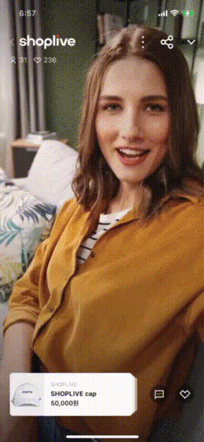

- [Shoplive iOS SDK](#shoplive-ios-sdk)
  - [소개](#소개)
  - [특징](#특징)
  - [요구 사양](#요구-사양)
  - [변경 사항](#변경-사항)
- [시작하기 전에](#시작하기-전에)
- [시작하기](#시작하기)
  - [`1 단계` 설치하기](#1-단계-설치하기)
    - [`방법 1` CocoaPods로 설치하기](#방법-1-cocoapods로-설치하기)
    - [`방법 2` Swift Package Manager로 설치하기](#방법-2-swift-package-manager로-설치하기)
  - [`2 단계` Shoplive Player 실행하기](#2-단계-shoplive-player-실행하기)
  - [`3 단계` Shoplive 채팅 사용하기](#3-단계-shoplive-채팅-사용하기)
  - [`4 단계` 쿠폰 사용하기](#4-단계-쿠폰-사용하기)
  - [`5 단계` 상품 관리하기](#5-단계-상품-관리하기)
  - [`6 단계` 방송 링크 공유하기](#6-단계-방송-링크-공유하기)
  - [`7 단계` PIP(Picture-in-Picture)로 실행하기](#7-단계-pippicture-in-picture로-실행하기)
  - [`8 단계` 인디케이터 설정하기](#8-단계-인디케이터-설정하기)
  - [`9 단계` Shoplive Player 재생 중 인터럽트 옵션 설정하기](#9-단계-shoplive-player-재생-중-인터럽트-옵션-설정하기)
  - [`10 단계` 태블릿 세로 모드에서 영상 비율 설정하기](#10-단계-태블릿-세로-모드에서-영상-비율-설정하기)
  - [`11 단계` 사용자 링크 선택 시 Shoplive Player의 다음 동작 설정하기](#11-단계-사용자-링크-선택-시-shoplive-player의-다음-동작-설정하기)
    
- [참고 - API Documentation](./api-document.md)

<br>

# Shoplive iOS SDK

<br>

## 소개
Shoplive iOS SDK는 여러분의 앱을 사용하는 고객에게 쉽고 빠르게 라이브 방송을 제공할 수 있는 모바일 SDK입니다. Shoplive PIP(Picture-in-Picture), 네이티브 키보드 UI 등 스마트폰에서 원활한 모바일 경험을 가능하게 합니다.

<image src="../_images/guide.gif" width="200" height="410"></image>

<br>

## 특징
- `CocoaPods` 또는 `Swift Package Manager`를 사용하여 설치할 수 있습니다.
- Shoplive Player를 사용하여 Shoplive 방송을 재생할 수 있습니다.
- 저화질/무음으로 설정한 Shoplive 방송을 영상 배너로 나타내어 사용자가 Shoplive 방송을 시청하도록 유도할 수 있습니다.
- 사용자가 Shoplive 방송을 시청하면서 채팅에 참여하고 상품을 검색하도록 할 수 있습니다.
- 앱 내 또는 홈 화면에서 Shoplive 방송을 PIP로 시작하고 전환할 수 있습니다.
- 미인증 사용자 모드로 채팅에 참여하고, 채팅에 참여한 사용자 정보를 실시간 전달받을 수 있습니다.
- 인증 사용자로 채팅에 참여하고, 간편 인증/보안 인증으로 사용자 계정을 통합할 수 있습니다.
- 채팅 대화명 및 채팅 폰트를 변경할 수 있습니다.
- 쿠폰을 사용할 수 있습니다.
- 여러 기능을 사용하여 상품을 관리할 수 있습니다.
- 기본 시스템 공유 UI를 사용하거나 커스텀 시스템 공유 UI를 사용할 수 있습니다.
- 재생 중인 방송 링크를 공유할 수 있습니다.
- Shoplive Player 재생 중 인터럽트 옵션을 설정할 수 있습니다.
- 태블릿 세로 모드에서 영상 비율을 설정할 수 있습니다.
- 재생 중인 방송에 관한 각종 정보를 실시간 전달받을 수 있습니다.
- Shoplive iOS SDK에 관한 각종 정보를 실시간 전달받을 수 있습니다. 

<br>

## 요구 사양
Shoplive iOS SDK를 사용하기 위한 최소 요구 사양입니다. 이 요구사항을 충족하지 않으면 Shoplive iOS SDK를 사용할 수 없습니다.
- `Xcode 12 이상`
- `iOS 11 이상`
- `iOS Deployment Target 11.0 이상`
- `Swift 4.2 이상`

<br>

## 변경 사항
- v1.2.2(2022-03-10)
  + 진동, 효과음 등 퀴즈 기능을 연계할 수 있도록 개선하였습니다.
  + 상품 또는 공지사항을 사용자가 선택하였을 때 앱 내 PIP로 강제 전환되던 기능에 다음 동작을 선택할 수 있는 API를 추가하였습니다.
  + Endpoint를 설정할 수 있는 API를 추가하였습니다.
  + Shoplive Player에서 Analog Dialog 또는 다른 화면이 있을 때는 Swipe-down 동작을 하더라도 앱 내 PIP로 전환되지 않도록 적용하였습니다.

- [[이전 버전 업데이트](./change-log.md)]

<br>

# 시작하기 전에

- Shoplive iOS SDK를 사용하려면 Shoplive 담당자에게 관리자 계정과 비밀번호를 요청하세요.
  + [[문의하기](mailto:ask@Shoplive.cloud)]
  + [[Shoplive 어드민 계정 발급받기 가이드](https://docs.shoplive.kr/docs/admin-account)]

- Shoplive 어드민에서 방송을 추가하고, 방송 키(Campaign Key)를 기록하세요.
  + [[방송 추가하기 가이드](https://docs.Shoplive.kr/docs/create-campaign)]

<br>

# 시작하기

Shoplive iOS SDK를 설치하여, 간단히 Shoplive Player에 적용하세요.

<br>

## `1 단계` 설치하기
다음 방법의 하나를 선택하여 Shoplive iOS SDK를 설치하세요.
> `Shoplive iOS SDK 설치는 반드시 하나의 방법으로만 설치해야 합니다.`  
> `[방법 1 CocoaPods로 설치하기] 및 [방법 2 Swift Package Manager로 설치하기]로 모두 설치하면, Shoplive iOS SDK가 중복 설치될 수 있습니다.`

<br>

### `방법 1` CocoaPods로 설치하기
`CocoaPods`를 사용하여 Shoplive iOS SDK를 설치할 수 있습니다.

- `CocoaPods`를 설정하세요.

    ```bash
    # Project 홈 디렉토리(.xcodeproj 확장자 파일이 있는 경로)로 이동하세요.
    cd ~/projects/PlayShopLive

    # CocoaPods가 설치되어있지 않으면 CocoaPods를 설치하세요.
    sudo gem install cocoapods

    # 기존 Project에서 CocoaPods를 설정한 적이 없으면 Podfile을 생성하세요.
    pod init
    ```
- 현재 사용 중인 Podfile에 다음 라인을 추가하세요.

    

    ```ruby
    source 'https://github.com/CocoaPods/Specs.git'

    # Project에 설정된 최소 지원 버전과 동일하게 설정하세요. 
    # Shoplive iOS SDK는 iOS 11.0 이상을 지원합니다. iOS 11.0 미만으로 설정할 수 없습니다.
    platform: ios, '11.0'
    use_frameworks!

    # Shoplive iOS SDK를 설치할 Project Target을 설정하세요.
    target 'PlayShopLive' do
        pod 'ShopLive', '1.2.2'
    end
    ```
- `CocoaPods`를 설치하세요.
    ```bash
    # Project 홈 디렉토리에서 설치 명령어를 실행하세요.
    # pod 저장소에 업데이트된 내용을 반영할 수 있도록 업데이트 명령어를 함께 실행하세요.

    # 방법 1. pod repo 업데이트 후, pod 설치
    pod repo update
    pod install

    # 방법 2. pod repo 업데이트와 pod 설치를 동시에 실행
    pod install --repo-update
    ```

    - Apple M1에서 설치가 되지 않으면, 다음 명령어를 실행하세요.
        ```bash
        sudo arch -x86_64 gem install ffi
        arch -x86_64 pod install
        ```
- 설치를 완료하면, Project에서 다음 항목을 확인하세요.
- Finder에서 생성된 파일을 확인하세요.

   
  
- xcworkspace 파일을 열어 Project를 확인하세요.

  

<br>

### `방법 2` Swift Package Manager로 설치하기
`Swift Package Manager`을 사용하여 Shoplive iOS SDK를 설치할 수 있습니다.

- Xcode Project의 Package Dependencies 탭으로 이동하세요.
    

- 설치할 Shoplive iOS SDK git 주소를 입력하고, `Up to Next Major Version`을 선택하고, 최신 버전을 설정하세요.
    `https://github.com/ShopLive/ios-SDK.git` 

    

- Shoplive iOS SDK 패키지를 적용할 Target을 선택하세요.
    

- Packages에 설치된 Shoplive iOS SDK를 확인하세요.
    

<br>

## `2 단계` Shoplive Player 실행하기


- 준비된 액세스 키(Access Key)를 사용하여, Shoplive iOS SDK를 초기화하세요.
  
    ```swift
    ShopLive.configure(with: "{AccessKey}")
    ```

    - API Reference
        > [configure(with:)](./api-document.md#configurewith)

    #### 방송 재생하기
    캠페인(방송) 키를 사용하여, 방송을 재생하세요.

    - 미리보기
        - 방송을 앱 내 PIP로 시작할 수 있습니다.
        - 미리보기는 음소거 상태로 재생됩니다.        

        ```swift
        ShopLive.preview(with: "{CampaignKey}", completion: nil)
        ```
        - API Reference
            > [preview(with:, completion:)](./api-document.md#previewwith-completion)

          

   - 재생하기
        ```swift
        ShopLive.play(with: "{CampaignKey}")
        ```
        - API Reference
          > [play(with:)](./api-document.md#playwith)
   
          

<br>

## `3 단계` Shoplive 채팅 사용하기


- ### 채팅 사용을 위한 준비하기
- Shoplive 어드민에서 채팅에 접속할 수 있는 사용자 접근 권한을 설정할 수 있습니다.
  + [[Shoplive 어드민 사용 가이드 - 방송 준비하기 - 대화 설정](https://docs.ShopLive.kr/docs/preps-for-campaign#%EB%8C%80%ED%99%94-%EC%84%A4%EC%A0%95)]


- ### 미인증 사용자로 채팅하기

     - 별도의 인증 없이 채팅에 연결합니다.
     - 미인증 사용자 채팅을 허용하지 않으면 채팅 버튼을 선택하더라도, 응답이 발생하지 않습니다.
     - 미인증 사용자 대화명을 필수로 설정하지 않으면, 미인증 사용자 대화명은 무작위로 지정됩니다. 

        

     - 미인증 사용자 대화명을 필수로 설정하고 채팅 버튼을 누르면, 미인증 사용자 대화명 설정 팝업이 나타납니다. 미인증 사용자 대화명을 설정해야 채팅에 연결됩니다. 

        

<br>

- ### 인증된 사용자로 채팅하기
    - #### 사용자 계정 통합
        - 간편 인증으로 연동하기
            - 사용자의 아이디와 로그인 사용자 대화명을 설정하는 기능을 통해 서비스의 사용자 계정을 통합할 수 있습니다.
            - 사용자 ID, 이름, 나이, 성별, 사용자 점수 및 기타 사용자 정의 데이터 정보를 설정할 수 있습니다. 


                ```swift
                import ShopLiveSDK

                var user = ShopLiveUser(
                    id: "{USER_ID}", 
                    name: "{USER_NAME}", 
                    gender: .male, 
                    age: 25)
                user.add(["userScore" : userScore])

                ShopLive.user = user
                ```

                - API Reference
                  > [user](./api-document.md#user)

                  <image src="../_images/chat_nickname.png" width="200" height="356"></image>

        - 보안 인증으로 연동하기
            - Shoplive 어드민에서 발급한 방송 키(Campaign Key)로 부여된 보안 인증토큰(JWT)을 사용하여, 사용자 아이디, 이름 등의 정보를 Shoplive iOS SDK에서 설정할 수 있습니다.

            <br>

             <B>[Shoplive 담당자에게 보안 인증토큰(JWT) 발급 요청]</B> 

             - 클라이언트 서버에서 보안 인증토큰(JWT)을 생성하고, Shoplive iOS SDK API를 통해 앱 클라이언트에 제공해야 합니다.)

             - Shoplive 어드민에서 발급한 방송 키(Campaign Key)를 사용하여 사용자를 인증할 수 있습니다. 

            <br>

             [[인증 토큰 생성 가이드](https://docs.ShopLive.kr/docs/use-jwt-auth)]


             ```swift
             ShopLive.authToken = "{USER_JWT}"
             ```

          - API Reference
                > [authToken](./api-document.md#authtoken)

<br>

- ### 대화명 변경하기
    - 사용자가 Shoplive Player에서 대화명을 변경하면, Shoplive iOS SDK는 onSetUserName 함수를 사용하여 해당 변경 사항을 클라이언트에 전달합니다.

        ```swift
        func onSetUserName(_ payload: [String : Any]) {
            payload.forEach { (key, value) in
            print("onSetUserName key: \(key) value: \(value)")
            }
        }
        ```
        
        - API Reference
          > [onSetUserName(_ payload: [String : Any])](./api-document.md#onsetusername_-payload)

<br>

- ### 채팅 폰트 변경하기
    - 채팅 폰트와 채팅 전송 버튼 폰트를 변경할 수 있습니다.

        

    - 폰트 변경
        ```swift
        // 채팅 폰트 설정
        let inputDefaultFont = UIFont.systemFont(ofSize: 14, weight: .regular)

        // 채팅 전송 버튼 폰트 설정
        let sendButtonDefaultFont = UIFont.systemFont(ofSize: 14, weight: .medium)

        let customFont = UIFont(name: "{Custom Font}", size: 16)
        
        // 채팅 폰트 및 채팅 전송 버튼 폰트 변경 
        ShopLive.setChatViewFont(inputBoxFont: customFont, sendButtonFont: customFont)
        ```

        - API Reference
          > [setChatViewFont(inputBoxFont:, sendButtonFont:)](./api-document.md#setchatviewfontinputboxfont-sendbuttonfont)

<br>

- ### 라이브 스트리밍을 하는 동안, Shoplive 어드민에서 채팅을 관리할 수 있습니다. 
  + [[Shoplive 어드민 사용 가이드 - 방송 콘솔 사용하기 - 채팅 관리](https://docs.ShopLive.kr/docs/manage-chat)]

<br>

## `4 단계` 쿠폰 사용하기
- 일반 쿠폰과 커스텀 쿠폰(팝업)을 사용할 수 있습니다.

    <image src="../_images/coupon.png" width="200" height="356"></image>

- 사용자가 쿠폰을 선택하였을 때 쿠폰 적용 흐름은 다음과 같습니다.

    <image src="https://github.com/shoplive/ios-sdk-sample/blob/main/doc/_images/Coupon%20selection_applying%20flow.jpg" width="729.4" height="353.4"></image>
    
- <B>일반 쿠폰</B>
  - 사용자는 방송화면에서 관리자가 등록한 일반 쿠폰을 선택하여 쿠폰에 설정된 혜택(예: 할인 등)을 신청할 수 있습니다.
    ```swift
    func handleDownloadCouponResult(with couponId: String, completion: @escaping (CouponResult) -> Void) {
        // 쿠폰 처리
        let result = CouponResult(couponId: couponId, success: false, message: "Coupon download failed.", status: .HIDE, alertType: .TOAST)
        completion(result)
    }
    ```

    - API Reference
      > [handleDownloadCouponResult(with: completion:)](./api-document.md#handledownloadcouponresultwith-completion)

- <B>커스텀 쿠폰(팝업)</B>
  - 사용자는 관리자가 등록한 커스텀 쿠폰(팝업)을 선택하여 쿠폰에 설정된 혜택((예: 할인 등)을 신청할 수 있습니다.
    
    ```swift
    func handleCustomActionResult(with id: String, type: String, payload: Any?, completion: @escaping (CustomActionResult) -> Void) {
        // 커스텀 쿠폰 처리
        let result = CustomActionResult(id: id, success: false, message: "coupon download failed.", status: .HIDE, alertType: .TOAST)
        completion(result)
    }
    ```

    - API Reference
      > [handleCustomActionResult(with id:, type:, payload:, completion:)](./api-document.md#handlecustomactionresultwith-id-type-payload-completion)

<br>

## `5 단계` 상품 관리하기
Shoplive Player 화면에서 상품을 선택하거나 장바구니 등을 선택하였을 때 발생하는 이벤트와 선택한 정보를 Shoplive iOS SDK가 클라이언트로 전달합니다. 

- ### Handler 함수로 이벤트 전달하기
    - #### handleReceivedCommand 
        
        - <B>CLICK_PRODUCT_DETAIL</B>
            - Shoplive Player 화면의 상품 목록에서 상품을 선택하면, Shoplive iOS SDK는 handleReceivedCommand 함수를 사용하여 선택한 상품 정보를 클라이언트에 전달합니다.
                ```swift
                func handleReceivedCommand(_ command: String, with payload: Any?) {
                    // print("handleReceivedCommand: \(command) payload: \(payload)")
                    
                    // 명령어: CLICK_PRODUCT_DETAIL
                    
                }
                ```

        - <B>CLICK_PRODUCT_CART</B>
            - Shoplive Player 화면의 상품 목록에서 장바구니 버튼을 클릭하면, Shoplive iOS SDK는 handleReceivedCommand 함수를 사용하여 장바구니 정보를 클라이언트에 전달합니다.

                ```swift
                func handleReceivedCommand(_ command: String, with payload: Any?) {
                    // print("handleReceivedCommand: \(command) payload: \(payload)")
                    
                    // 명령어: CLICK_PRODUCT_CART   
                }
                ```

        - API Reference
          > [handleReceivedCommand(_ command: , with payload:)](./api-document.md#handlereceivedcommand_-command--with-payload)

      <br>

    - #### handleNavigation 
        재생 중인 방송화면에서 상품, 배너 등을 선택했을 때, Shoplive iOS SDK는 handleNavigation 함수를 사용하여 선택 항목의 URL 정보를 클라이언트에 전달합니다.

            ```swift
            func handleNavigation(with url: URL) {
                // URL: 선택한 상품 또는 배너에 설정된 상세 정보 URL
                print("handleNavigation \(url)")
            }
            ```

        - API Reference
          > [handleNavigation(with:)](./api-document.md#handlenavigationwith)
        
        <br>

- ### API 함수로 이벤트 전달하기
    - #### hookNavigation
        hookNavigation을 사용하면, 사용자가 상품 또는 배너를 선택하였을 때 parameter에 설정한 block으로 직접 이벤트를 받습니다.

        ```swift
        ShopLive.hookNavigation { url in
            // url: 선택한 상품 또는 배너에 설정된 상세 정보 URL
            print("hookNavigation \(url)")
        }
        ```

        - API Reference
          > [hookNavigation(navigation: @escaping ((URL) -> Void))](./api-document.md#hooknavigationnavigation-escaping-url---void)

          <br>


## `6 단계` 방송 링크 공유하기
> Shoplive의 공유하기 API를 통해서 방송의 URI Scheme 또는 URL을 손쉽게 공유할 수 있습니다.

- ### 공유 링크 형식
    - **Set up URI Scheme**
        ```swift
        let scheme = "{your host}://{your host}?ak=xxx&ck=yyy"
        ShopLive.setShareScheme(with: scheme, custom: nil)
        ```

    - **Set up URL**
        ```swift
        let url = "https://www.share_link.com/?ak=xxx&ck=yyy"
        ShopLive.setShareScheme(with: "https://www.share_link.com/?ak=xxx&ck=yyy", custom: nil)
        ```

    - API Reference
      > [setShareScheme(_ scheme:, custom:)](./api-document.md#setsharescheme_-scheme-custom)

<br>

- ### 기본 시스템 공유 UI 사용하기
    

    ```swift
    ShopLive.setShareScheme(scheme, custom: nil)
    ```

- ### 커스텀 시스템 공유 UI 사용하기
    

    ```swift
    ShopLive.setShareScheme(scheme, custom: {
        let customShareVC = CustomShareViewController()
        customShareVC.modalPresentationStyle = .overFullScreen

        // 커스텀 시스템 공유 UI ViewController를 생성하여, Shoplive Player 화면(viewController)에 나타냅니다.
        ShopLive.viewController?.present(customShareVC, animated: false, completion: nil)
    })
    ```

- 재생 중인 방송의 링크를 주변 또는 SNS에 전달하여, 링크 클릭만으로 앱 설치 또는 방송 시청을 유도할 수 있습니다.
(단, 앱에서 별도 deeplink를 처리해야 합니다.)

    

<br>

## `7 단계` PIP(Picture-in-Picture)로 실행하기
방송을 시청하다가 다른 작업을 수행할 때, PIP 모드로 전환할 수 있습니다. 

- ### 앱 내 PIP 전환하기
    - Shoplive Player 화면에서 PIP 아이콘을 선택하거나, Swipe down 제스쳐를 사용하여, 재생 중인 방송 화면을 앱 내에서 작은 창으로 전환시킬 수 있습니다.
    - 미리보기 기능과 다르게 앱 내 PIP로 전환해도 방송 중인 오디오를 계속 재생합니다.

        

    <br>

    - PIP 크기 설정하기  
        앱 내 PIP의 크기를 설정할 수 있습니다.

        > 크기 설정 예시

        ```swift
        // 기본값: 0.4

        // 0.1배 크기로 설정
        ShopLive.pipScale = 0.1

        // 0.8배 크기로 설정
        ShopLive.pipScale = 0.8
        ```

        | 크기 | PIP 화면 | 크기 | PIP 화면 | 크기 | PIP 화면 |
        | ----------- | --- | ----------- | --- | ----------- | --- |
        | 0.1 |  | 0.4(기본값) |  | 0.8 |  |

<br>

- ### OS PIP 전환하기
    - 방송 재생 중 홈 버튼 또는 홈 인디케이터를 통해 홈 화면으로 이동하거나 다른 앱으로 이동하더라도 재생 중인 방송을 iOS 내에서 작은 창으로 전환시킬 수 있습니다.
    - Project에 다음과 같이 설정하세요.

        

        

- ### API를 사용하여 앱 내 PIP 전환하기
    - #### 앱 내 PIP로 전환하기
        ```swift
        ShopLive.startPictureInPicture()
        ```
    
    - #### 전체화면으로 전환하기
        ```swift
        ShopLive.stopPictureInPicture()
        ```

    - API Reference
      > [startPictureInPicture(with: , scale: )](./api-document.md#startpictureinpicturewith--scale-)  
      > [stopPictureInPicture()](./api-document.md#stoppictureinpicture)

<br>


## `8 단계` 인디케이터 설정하기

- ### 인디케이터 스스 설정하기
    - 방송에 진입하여 영상 로딩 중 보이는 인디케이터 스타일을 변경할 수 있습니다.

    - 인디케이터 색 변경 (기본값: 흰색)
        ```swift
        ShopLive.indicatorColor = UIColor.purple
        ```
        

     <br>

    - API Reference  
      > [indicatorColor](./api-document.md#indicatorcolor)

<br>


- ### 이미지 애니메이션 인디케이터 설정하기
    > 인디케이터를 이미지 애니메이션으로 설정할 수 있습니다. 

    

    ```swift
    var images: [UIImage] = []

    for i in 1...11 {
        images.append(.init(named: "loading\(i)")!)
    }

    ShopLive.setLoadingAnimation(images: images)
    ```

    - API Reference
      > [setLoadingAnimation(images:)](./api-document.md#setloadinganimationimages)

<br>


## `9 단계` Shoplive Player 재생 중 인터럽트 옵션 설정하기
> 재생 중 통화 또는 이어폰 연결 유실 등으로 인한 인터럽트 이벤트 발생 시, 인터럽트 이벤트가 끝난 후 Shoplive Player 재생 동작을 설정할 수 있습니다.

- ### 이어폰(또는 헤드셋) 연결 끊김으로 인한 인터럽트
    > 이어폰 또는 헤드셋 연결이 끊겼을 때 다시 연결되면 자동으로 방송이 재생되도록 설정할 수 있습니다.

    ```swift
    // 옵션 설정 - true: 자동재생, 기본값: false
    ShopLive.setKeepPlayVideoOnHeadphoneUnplugged(true)

    // 옵션 설정 확인
    print(ShopLive.isKeepPlayVideoOnHeadPhoneUnplugged())
    ```

    - API Reference
      > [setKeepPlayVideoOnHeadphoneUnplugged(_ keepPlay: Bool)](./api-document.md#setkeepplayvideoonheadphoneunplugged_-keepplay-bool)  
      > [isKeepPlayVideoOnHeadPhoneUnplugged() -> Bool](./api-document.md#iskeepplayvideoonheadphoneunplugged---bool)

- ### 통화 연결로 인한 인터럽트
    > 통화 종료 후 방송으로 돌아왔을 때, 자동 재생이 되도록 설정할 수 있습니다.

    ```swift
    // 옵션 설정 - true: 자동재생, 기본값: false
    ShopLive.setAutoResumeVideoOnCallEnded(true)

    // 옵션 설정 확인
    print(ShopLive.isAutoResumeOnCallEnded())
    ```

    - API Reference
      > [setAutoResumeVideoOnCallEnded(_ autoResume: Bool)](./api-document.md#setautoresumevideooncallended_-autoresume-bool)  
      > [isAutoResumeVideoOnCallEnded() -> Bool](./api-document.md#isautoresumevideooncallended---bool)

<br>


## `10 단계` 태블릿 세로 모드에서 영상 비율 설정하기
> 태블릿의 세로 모드에서 Shoplive 화면의 비율을 유지하거나 화면을 가득 채우도록 할 수 있습니다.

| 화면 채움 | 비율 유지 | 
| ----------- | ----------- |
|  |  | 

```swift
// 화면 비율 유지
ShopLive.setKeepAspectOnTabletPortrait(true)

// 화면 가득 채움
ShopLive.setKeepAspectOnTabletPortrait(false)
```

- API Reference
   > [setKeepAspectOnTabletPortrait(_ keep:)](./api-document.md#setkeepaspectontabletportrait_-keep)

<br>


## `11 단계` 사용자 링크 선택 시 Shoplive Player의 다음 동작 설정하기

> 사용자가 상품, 공지사항, 배너 등 링크를 선택하였을 때, Shoplive Player의 다음 동작을 설정할 수 있습니다.

+ PIP 전환하기

    

    ```swift
    ShopLive.setNextActionOnHandleNavigation(.PIP)
    ```

+ 상태 유지하기

    

    ```swift
    ShopLive.setNextActionOnHandleNavigation(.KEEP)
    ```

+ 종료하기 

    

    ```swift
    ShopLive.setNextActionOnHandleNavigation(.CLOSE)
    ```
<br>

+ API Reference
    > [setNextActionOnHandleNavigation(actionType:)](./api-document.md#setnextactiononhandlenavigationactiontype)  
    > [getNextActionTypeOnHandleNavigation() -> ActionType](./api-document.md#getnextactiontypeonhandlenavigation---actiontype)
    

<br>

